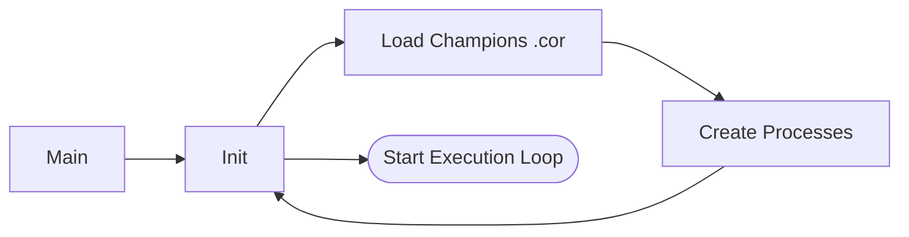
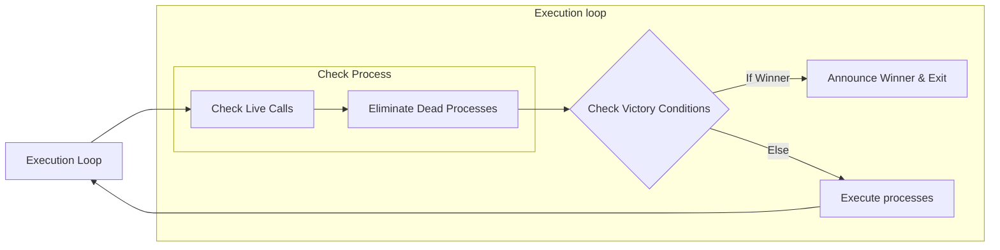
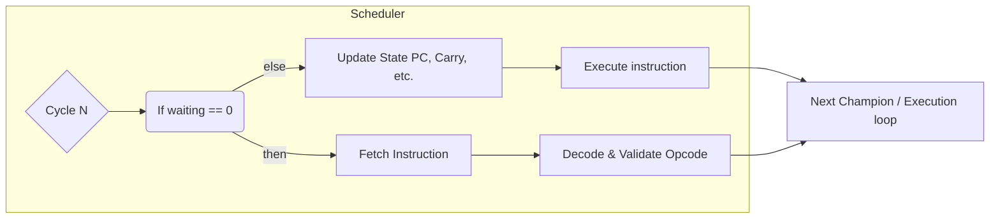
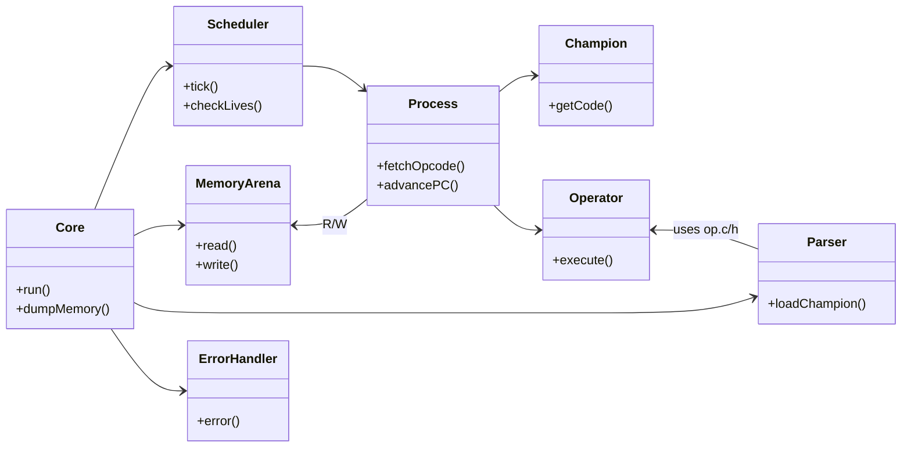
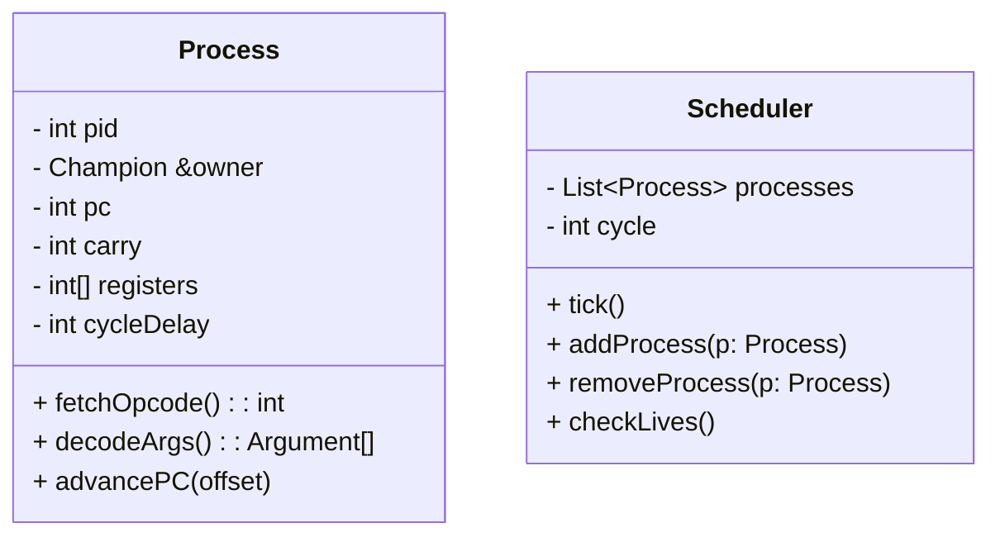
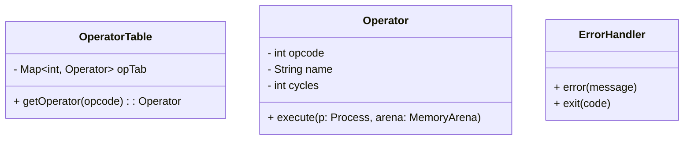

# 🧠 Corewar  
## Création d'un interpreteur en C

<div class="text-sm op75 mt-2 text-teal-500">Construisez une machine virtuelle. Chargez des champions.</div>

---


# ⚔️ Qu’est-ce que le Corewar ?

- 🧬 Une simulation où des **programmes s’affrontent** en mémoire partagée  
- 🎯 Objectif : être le **dernier champion actif**  
- ⚙️ Vous codez la **machine virtuelle** qui les exécute

---

# 🛠️ Votre Mission

## Créer une **machine virtuelle** en C

- Exécutez les fichiers `.cor` compilés  
- Gérez les cycles, la mémoire, les processus et les instructions  
- Surveillez les appels à `live` pour déterminer le vainqueur  

<div class="mt-4 p-4 bg-yellow-50 border-l-4 border-yellow-400 rounded shadow">
⚠️ Vous devez supporter toutes les instructions définies dans <code>op.c</code> et <code>op.h</code>
</div>

---

# 📦 Exemple d’Instructions

| Opcode | Nom   | Description                        |
| ------ | ----- | ---------------------------------- |
| 0x01   | live  | Le joueur signale qu’il est vivant |
| 0x04   | add   | Additionne deux registres          |
| 0x09   | zjmp  | Saut conditionnel (si carry == 1)  |
| 0x0f   | lfork | Fork sans modulo                   |

> Voir `op.c` et `op.h` pour la liste complète

---

# 💾 Modèle de Mémoire

* 🧱 Arène partagée : `MEM_SIZE` octets
* 🔁 Chaque processus possède :

  * Registres (`REG_NUMBER`)
  * Un compteur de programme (PC)
  * Un flag Carry

> Les processus sont **planifiés par cycle**, selon leur ID

---

# 💻 Exemple de Lancement

```bash
./corewar -dump 100 champion1.cor champion2.cor
```

| Option    | Description                            |
| --------- | -------------------------------------- |
| `-dump N` | Affiche l’état mémoire au cycle N      |
| `-n`      | Définit un numéro de joueur spécifique |
| `-a`      | Définit l’adresse de chargement        |

---

# 🧠 Concepts Clés

| Concept   | Description                       |
| --------- | --------------------------------- |
| PC        | Position actuelle du code         |
| Carry     | Vaut 1 si le dernier résultat = 0 |
| Champion  | Programme joueur chargé dans l’arène |
| Processus | Instance en cours d’un champion   |
| Cycle     | Battement d’horloge de la VM      |


---
layout: top-title
color: blue-light
---
:: title ::
# Corewar : Architecture 
:: content ::



---
layout: top-title
color: blue-light
---
:: title ::
# Corewar : Architecture 
:: content ::



---
layout: top-title
color: blue-light
---
:: title ::
# Corewar : Architecture 
:: content ::

# For each champion
<br/>


---
layout: top-title
color: blue-light
---
:: title ::
# Corewar : Architecture 
:: content ::




---
layout: top-title
color: blue-light
---
:: title ::
# Corewar : Architecture 
:: content ::


# Corewar Class Diagram – Partie 1

```mermaid
classDiagram
  direction TB

  class Core {
    - MemoryArena arena
    - Scheduler scheduler
    - Parser parser
    - ErrorHandler errorHandler
    + run()
    + dumpMemory(cycle)
  }
````

---
layout: top-title
color: blue-light
---

:: title ::
# Corewar : Architecture 
:: content ::


# Corewar Class Diagram – Partie 2

```mermaid
classDiagram
  direction TB

  class MemoryArena {
    - byte[] cells
    + read(addr, size) 
    + write(addr, data)
    + dump()
  }

  class Parser {
    + loadChampion(filePath) : Champion
    + parseHeader(bytes) : Header
  }

  class Champion {
    - int id
    - String name
    - byte[] code
    + getCode()
    + getSize()
  }
```

---
layout: top-title
color: blue-light
---

:: title ::
# Corewar : Architecture 
:: content ::


# Corewar Class Diagram – Partie 3



---
layout: top-title
color: blue-light
---

:: title ::
# Corewar : Architecture 
:: content ::


# Corewar Class Diagram – Partie 4



