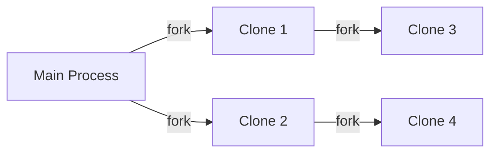
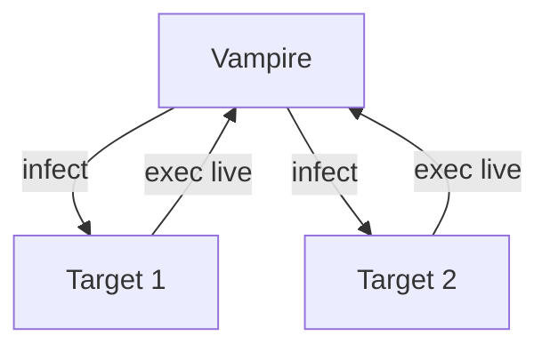

<div class="text-center">

# 🏆 Corewar Tournament
## Create the deadliest Redcode champion
<div class="text-xl mt-4">Battle in 1v1 matches • Win cash prizes • Claim glory</div>
</div>

---

# Tournament Structure

<div class="grid grid-cols-3 gap-6 mt-8">
<div class="p-6 bg-crimson-50 border-l-4 border-crimson-500 rounded-lg">
<strong>⏱️ Duration</strong>
<div class="text-2xl mt-2">4 Days</div>
<div class="text-sm">Build your champions</div>
</div>

<div class="p-6 bg-amber-50 border-l-4 border-amber-500 rounded-lg">
<strong>⚔️ Battles</strong>
<div class="text-2xl mt-2">3 Rounds</div>
<div class="text-sm">1v1 elimination</div>
</div>

<div class="p-6 bg-emerald-50 border-l-4 border-emerald-500 rounded-lg">
<strong>🏆 Winners</strong>
<div class="text-2xl mt-2">3 Prizes</div>
<div class="text-sm">Cash rewards</div>
</div>
</div>

<div class="mt-8 p-6 bg-blue-50 rounded-xl border border-blue-300">
💡 <strong>How it works:</strong> Each match runs until one champion remains active. The winner advances to next round.
</div>

---

# Champion Submission

<div class="grid grid-cols-2 gap-8">
<div>
<strong>📂 Repository Structure</strong>
```bash
Your-Name/
├── Champion-1/
│   ├── destroyer.s    # Redcode assembly
│   ├── id.md          # Identity file
│   └── logo.png       # Optional
├── Champion-2/
│   ├── replicator.s
│   └── id.md
└── Champion-3/
    ├── vampire.s
    └── id.md
```

</div>
<div>
<strong>📝 Identity File (id.md)</strong>
```markdown
Name: Destroyer of Humanity
Logo: destroyer-logo.png

Strenght: Replicates endlessly while bombing
Weakness: Vulnerable to quick scanners

This champion uses advanced spiral bombing...
```
</div>
</div>

<div class="mt-6 p-4 bg-red-50 border-l-4 border-red-500 rounded">
⚠️ <strong>Deadline:</strong> Submit before tournament day on provided Git repository
</div>

---

# 🏆 Prize Pool

<div class="grid grid-cols-3 gap-6 mt-8 text-center">
<div class="p-8 bg-gradient-to-b from-yellow-300 to-yellow-500 rounded-xl">
<div class="text-4xl">🥇 1st</div>
<div class="text-3xl font-bold mt-4">50€</div>
<div class="text-sm mt-2">BDE Prize</div>
</div>

<div class="p-8 bg-gradient-to-b from-gray-300 to-gray-400 rounded-xl">
<div class="text-4xl">🥈 2nd</div>
<div class="text-3xl font-bold mt-4">20€</div>
<div class="text-sm mt-2">BDE Prize</div>
</div>

<div class="p-8 bg-gradient-to-b from-amber-600 to-amber-800 rounded-xl">
<div class="text-4xl">🥉 3rd</div>
<div class="text-3xl font-bold mt-4">10€</div>
<div class="text-sm mt-2">BDE Prize</div>
</div>
</div>

<div class="mt-8 p-6 bg-gradient-to-r from-purple-400 to-crimson-500 text-white rounded-lg">
🏆 <strong>Bonus:</strong> Eternal glory in Corewar Hall of Fame
</div>

---

# Battle Strategies

<div class="grid grid-cols-2 gap-8 mt-6">
<div>
<strong>⚔️ Offensive Tactics</strong>
```asm
; Precision bombing
scan_loop:
    ldi %:scan_pos, r2
    zjmp %:target_found
    add r4, r5, r4
    zjmp %:scan_loop

target_found:
    sti r1, r4, %0   ; Plant bomb
```

</div>
<div>
<strong>🛡️ Defensive Tactics</strong>
```asm
; Survival loop
survivor:
    live %1          ; Stay active
    fork %:decoy     ; Create distraction
    zjmp %:survivor  ; Repeat
```
</div>
</div>

---

# Champion Development Tips

<div class="grid grid-cols-2 gap-6 mt-4">
<div class="p-4 bg-green-50 rounded-lg">
<strong>🧪 Testing</strong>
```bash
./corewar your_champ.cor opponent.cor
```
- Test against all opponent types
<br/>- Verify different memory positions
</div>

<div class="p-4 bg-blue-50 rounded-lg">
<strong>⚙️ Optimization</strong>
```asm
; Instead of:
ld %0, r1
ld %100, r2

; Use:
xor r1, r1, r1   ; Clear r1 and set carry
ld %100, r2
```
</div>

<div class="p-4 bg-purple-50 rounded-lg">
<strong>🎭 Deception</strong>
```asm
; Insert dummy code
dat 0, 0, 0, 0, 0
dat 0, 0, 0, 0, 0
real_code:
    live %1
```
</div>

<div class="p-4 bg-amber-50 rounded-lg">
<strong>🧠 Meta Strategies</strong>
- Create 3 specialized champions:
<br/>  1. Bomber vs Survivors
<br/>  2. Scanner vs Bombers
<br/>  3. Hybrid vs Unknown
</div>
</div>

---


# Tournament Challenges

<div class="grid grid-cols-3 gap-6 mt-8">
<div class="p-6 bg-crimson-50 border-l-4 border-crimson-500 rounded-lg">
<strong>1. Survivor</strong>
<div class="text-sm mt-2">Only says `live`</div>
<div class="text-xs mt-1 text-crimson-700">Weakness: Never says live</div>
</div>

<div class="p-6 bg-amber-50 border-l-4 border-amber-500 rounded-lg">
<strong>2. Attack</strong>
<div class="text-sm mt-2">Touches opponents once</div>
<div class="text-xs mt-1 text-amber-700">Opponent: Survivor</div>
</div>

<div class="p-6 bg-emerald-50 border-l-4 border-emerald-500 rounded-lg">
<strong>3. Replicator</strong>
<div class="text-sm mt-2">Copies itself endlessly</div>
<div class="text-xs mt-1 text-emerald-700">Weakness: Self-vulnerable</div>
</div>

<div class="p-6 bg-purple-50 border-l-4 border-purple-500 rounded-lg">
<strong>4. Bomber</strong>
<div class="text-sm mt-2">Plants traps everywhere</div>
<div class="text-xs mt-1 text-purple-700">Weakness: Static</div>
</div>

<div class="p-6 bg-blue-50 border-l-4 border-blue-500 rounded-lg">
<strong>5. Scanner</strong>
<div class="text-sm mt-2">Finds and eliminates targets</div>
<div class="text-xs mt-1 text-blue-700">Opponent: Bomber</div>
</div>

<div class="p-6 bg-pink-50 border-l-4 border-pink-500 rounded-lg">
<strong>6. Vampire</strong>
<div class="text-sm mt-2">Infects others to survive</div>
<div class="text-xs mt-1 text-pink-700">Opponent: Replicator</div>
</div>
</div>

---

# Challenge 1: Survivor
## The Passive Opponent

```asm
.name "Survivor"
.comment "I just live"

loop:
    live %1      ; Announce existence
    zjmp %:loop  ; Infinite loop
```

<div class="grid grid-cols-2 gap-4 mt-6">
<div class="p-4 bg-green-50 rounded border-l-4 border-green-400">
✅ <strong>Strengths</strong>
<br/>- Minimal resource usage
<br/>- Hard to detect
</div>

<div class="p-4 bg-red-50 rounded border-l-4 border-red-400">
⚠️ <strong>Weakness</strong>
<br/>- No self-preservation
<br/>- Vulnerable to any attack
</div>
</div>

---

# Challenge 2: Attack
## The Aggressor

```asm
.name "Attack"
.comment "Strike once, win forever"

setup:
    ld %0, r2       ; Clear carry
    ld %:target, r3 ; Load target address
    
attack_loop:
    st r1, r3     ; Overwrite enemy code
    live %1          ; Stay alive
    zjmp %:attack_loop
```

<div class="mt-4 p-4 bg-amber-100 rounded-lg">
💡 <strong>Strategy:</strong> Target Survivor's live instruction to disable it
</div>

---

# Challenge 3: Replicator
## The Self-Copier



```asm
replicate:
    lfork %:replicate  ; Create clone
    live %1            ; Stay active
    zjmp %:replicate   ; Repeat
```

<div class="mt-4 p-4 bg-purple-100 rounded-lg">
💡 <strong>Weakness Exploit:</strong> Target the initial replication point
</div>

---

# Challenge 4: Bomber
## The Trap Master

```asm
bombing_run:
    sti r1, %:bomb, %1   ; Plant bomb
    add r2, r3, r2       ; Move position
    live %1
    zjmp %:bombing_run

bomb:
    dat 0, 0, 0, 0       ; Bomb location
```

<div class="grid grid-cols-2 gap-4 mt-4">
<div class="p-4 bg-blue-50 rounded-lg">
<strong>Bomb Types</strong>
- DAT overwrites
- Infinite loops
- Process killers
</div>
<div class="p-4 bg-red-50 rounded-lg">
<strong>Counter</strong>
- Memory scanning
- Safe execution zones
- Bomb disposal routines
</div>
</div>

---

# Challenge 5: Scanner
## The Precision Hunter

```asm
scan_loop:
    ldi %:scan_pos, r2  ; Load memory value
    and r2, r2, r3      ; Check if non-zero
    zjmp %:found        ; Jump if target found
    add r4, r5, r4      ; Move to next position
    live %1
    zjmp %:scan_loop

found:
    st r1, [r4]         ; Eliminate target
```

<div class="mt-4 p-4 bg-teal-100 rounded-lg">
💡 <strong>Efficiency Tip:</strong> Use prime-number step sizes to avoid pattern detection
</div>

---

# Challenge 6: Vampire
## The Parasite



```asm
infect:
    sti r1, %:vampire_code, %target
    fork %:infect      ; Spread infection
    live %1
    zjmp %:infect

vampire_code:
    ; Code to force target to execute live for vampire
```


---

# Final Challenge: Game of Life

<div class="text-center py-8">
<div class="text-xl">Combine all strategies in the ultimate battle</div>
<div class="mt-6 text-3xl font-bold mb-4">🏆 vs 42.cor</div>

<div class="mt-8 grid grid-cols-2 gap-8">
<div class="p-6 bg-gradient-to-r from-crimson-400 to-amber-400 rounded-xl">
<strong>Your Champion</strong>
</div>
<div class="p-6 bg-gradient-to-r from-blue-400 to-purple-400 rounded-xl">
<strong>Opponent</strong>
<div class="mt-2">Evolved replicator-bomber</div>
</div>
</div>

<div class="mt-8 text-2xl font-bold">
Good luck, Warriors!
</div>
</div>

---

# Core Instructions

<div class="overflow-x-auto">
<table class="w-full text-sm">
<thead class="bg-gray-100">
  <tr>
    <th class="p-2">Opcode</th>
    <th class="p-2">Mnemonic</th>
    <th class="p-2">Description</th>
    <th class="p-2">Battle Usage</th>
  </tr>
</thead>
<tbody>
  <tr><td>0x01</td><td>live</td><td>Declare activity</td><td>Survival essential</td></tr>
  <tr><td>0x02</td><td>ld</td><td>Load value</td><td>Setup positions</td></tr>
  <tr><td>0x03</td><td>st</td><td>Store value</td><td>Plant bombs</td></tr>
  <tr><td>0x09</td><td>zjmp</td><td>Conditional jump</td><td>Loop control</td></tr>
  <tr><td>0x0c</td><td>fork</td><td>Create process</td><td>Replication</td></tr>
  <tr><td>0x0b</td><td>sti</td><td>Store indexed</td><td>Precise bombing</td></tr>
</tbody>
</table>
</div>

---

# Battle Strategies

<div class="grid grid-cols-2 gap-6 mt-4">
<div class="p-4 bg-crimson-50 rounded-lg">
<strong>🧨 Bombing Tactics</strong>
```asm
; Spiral bombing
sti r1, r2, r3
add r2, r4, r2   ; Move position
```

</div>
<div class="p-4 bg-blue-50 rounded-lg">
<strong>🕵️ Scanning Techniques</strong>
```asm
; Parity scanning
ldi %:scan_pos, r1
and r1, r1, r2
zjmp %:target_found
```
</div>
<div class="p-4 bg-purple-50 rounded-lg">
<strong>🧬 Replication Patterns</strong>
```asm
; Dual-role splitting
fork %:attacker
fork %:survivor
```
</div>
<div class="p-4 bg-green-50 rounded-lg">
<strong>🛡️ Survival Tricks</strong>
```asm
; Carry reset
ld %0, r1   ; Set carry=1
zjmp %:safe_loop
```
</div>
</div>

---

# Tournament Pro Tips

1. **Size Matters**  
   Keep champions small (< 512 bytes)

2. **Split Smart**  
   Fork every 50-100 cycles

3. **Stealth Mode**  
   Surround code with zeros to avoid detection

4. **Bomb Efficiently**  
   Focus on critical enemy instructions

```bash
# Test command
./corewar champion.cor opponent.cor
```


---

# Final Preparation

<div class="grid grid-cols-2 gap-8 mt-6">
<div>
<strong>🛠️ Last Checks</strong>
<br/>1. Verify all champions compile
<br/>2. Test against all opponent types
<br/>3. Optimize critical loops
<br/>4. Add deceptive dummy code
<br/>5. Prepare identity files
</div>
<div>
<strong>📚 Resources</strong>
<br/>- Corewar documentation
<br/>- Redcode cheatsheet
<br/>- Sample champions
<br/>- VM testing tools
<br/>- Strategy guides
</div>
</div>

<div class="mt-8 p-8 bg-gradient-to-r from-crimson-500 to-amber-500 text-white rounded-xl text-center">
<div class="text-3xl font-bold mb-4">Need Help?</div>
<div class="text-xl">Contact your local assistant anytime</div>
<div class="mt-4 text-2xl">👾 Happy Coding Warriors! 👾</div>
</div>
